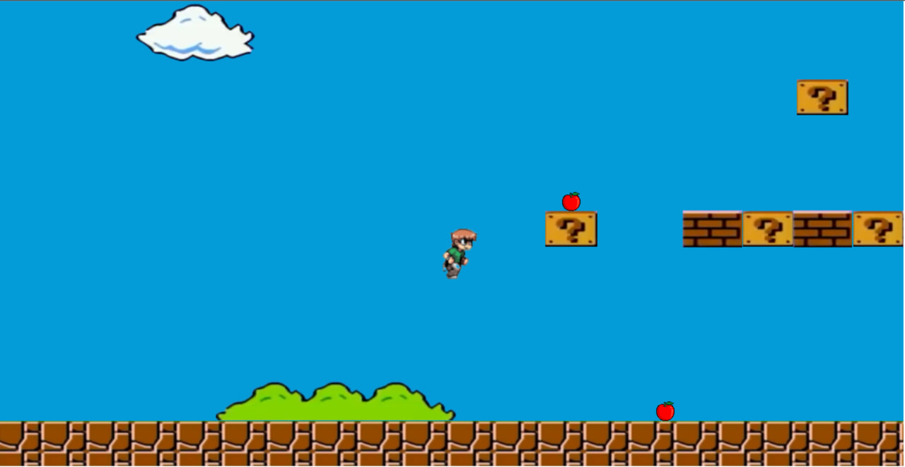

## Mario o‘yinini Phasez.js yordamida yaratganingiz juda qiziq!

**Phasez.js** – 2D o‘yinlar yaratish uchun qulay JavaScript kutubxonasi bo‘lib, u soddaligi va kuchli vositalari bilan ajralib turadi. Ushbu kutubxona animatsiyalarni boshqarish, fizika, kolliziyalarni aniqlash va o‘yin obyektlarini boshqarishda yordam beradi.

### Mario o‘yini haqida qisqacha ma'lumot:

- **O‘yin mexanikasi**:  
  Mario o‘yini platforma janriga kiradi, bunda asosiy maqsad Mario bilan to‘siqlarni yengib, belgilangan maqsadga yetib borishdir. Sizning versiyangizda, Phasez.js yordamida harakatlar, sakrashlar va kolliziyalarni to‘g‘ri sozlash o‘yin tajribasini qiziqarli qiladi.

- **Fizika**:  
  Phasez.js o‘z ichiga jismoniy qonunlarni olish imkonini beradi, bu esa o‘yinda sakrashlar, tezlik o‘zgarishlari va obyektlarning o‘zaro ta'sirini realistik qilishingizga yordam beradi.

- **Grafika**:  
  Mario o‘yini uchun klassik 2D grafikalardan foydalanishingiz mumkin. Phasez.js sprite atlaslari va animatsiyalarni qo‘llab-quvvatlagani sababli, harakatlanayotgan Mario, raqiblar va to‘siqlarni jonlantirish juda sodda va samarali amalga oshiriladi.

- **Interaktivlik**:  
  O‘yin davomida Mario ko‘plab dushmanlar bilan to‘qnashadi, qimmatbaho tanga va kuchaytiruvchi predmetlarni yig‘adi, bu o‘yinga yanada ko‘proq zavq qo‘shadi.

---

### Foydalanuvchilarni qiziqtirish uchun tavsiya:

O‘yin o‘ynash jarayonida soddalik va qiziqarli elementlarga e'tibor qarating. Har bir darajaga yangi qiyinchilik va bonus elementlarini qo‘shish, o‘yinni yanada jozibador qiladi.

_O‘zingizning Mario o‘yiningiz haqida video yoki rasm orqali ko‘rsatsangiz, bu ham ko‘proq qiziqish uyg‘otadi!_

[**Play now**](https://mario-game-io.vercel.app/)